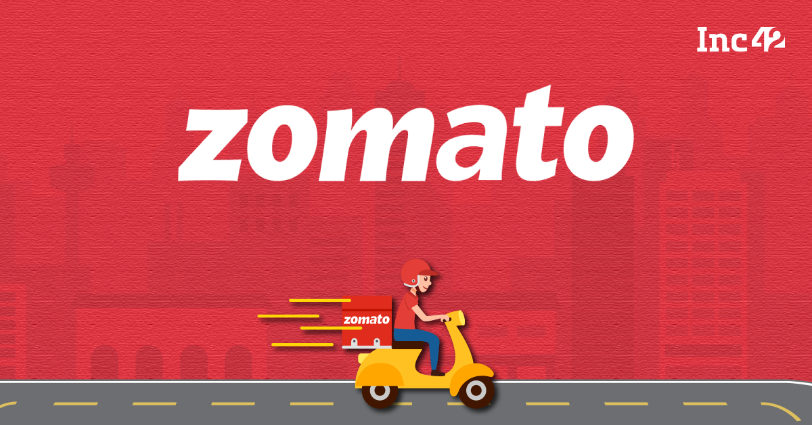

# Zomato Data Exploration and Analysis with SQL (SQL Server)

## Overview
Zomato is an Indian online food ordering and delivery platform that connects customers with restaurants across various cities. By analyzing the Zomato dataset, we aim to uncover insights into customer behavior, restaurant performance, popular cuisines, and delivery trends to understand the business operations better. 

The dataset contains tables like `food`,`orders`, `users`, `restaurant`, and `menu`, providing valuable data points such as user information, sales, order trends, and restaurant performance.

## Dataset

The data for this project is sourced from the Kaggle dataset:

- **Dataset Link:** [Zomato Dataset](https://www.kaggle.com/datasets/anas123siddiqui/zomato-database)
  
## Data Exploration with SQL

While exploring the Zomato dataset, the following tasks were undertaken:

1. Inspecting the Dataset
   - Verified table structures, column names, and data types.
   - Examined primary and foreign key relationships, such as `user_id`, `r_id`, and `order_date`.
   - Checked for missing values, duplicate entries, and inconsistencies in key attributes.

2. Data Cleaning
   - Removed duplicate entries in tables like `orders` and `users`.
   - Corrected spelling inconsistencies in city names and restaurant names.
   - Ensured consistency in categorical data such as cuisines and customer segments.

3. Data Enrichment
   - Created derived columns like `spending_category`, `order_day`, and `cuisine_rank`.
   - Merged datasets to integrate details about restaurants, users, and menu items.

4. Summary Statistics
   - Calculated aggregate statistics such as average delivery time, total orders per user, and total sales by restaurant.

5. Rolling Counts and Trends
   - Used SQL window functions to compute rolling averages and growth metrics over time for sales and customer activity.

---

## Data Analysis with SQL

Based on the queries designed, the following insights were derived:

### 1. Customer Insights
- Identified top customers by order frequency and total spend.
- Repeat customers account for a significant portion of the total sales, showcasing customer loyalty.

### 2. Restaurant Performance
- Ranked restaurants by total sales and customer ratings.
- Identified high-performing restaurants in specific cities such as Bangalore and Hyderabad.

### 3. Food Trends
- Determined the most popular food items by cuisine and total orders.
- North Indian and Chinese cuisines emerged as the most frequently ordered categories.

### 4. Geographic Insights
- Analyzed city-wise restaurant performance, with Bangalore, Delhi, and Hyderabad being the top contributors to total sales.
- Identified the top-performing restaurants in each city based on sales and ratings.

### 5. Customer Segmentation
- Classified customers into segments such as "Premium," "Gold," and "Standard" based on spending.
- High spenders contribute a significant percentage of the total revenue.

### 6. Delivery Trends
- Average delivery time across cities is approximately 35 minutes, with longer times observed during peak hours.
- Weekend orders exhibit a higher frequency, particularly for cuisines like fast food and pizza.

### 7. Churn Analysis
- Identified customers at risk of churn based on inactivity and days since the last order.
- Suggested strategies like targeted discounts and loyalty programs to retain high-risk customers.

## Highlights and Advanced Insights

1. Customer Insights
   - Customers categorized as "Premium" tend to order more frequently and spend significantly higher than other segments.

2. Restaurant Performance
   - Restaurants with ratings above 4 tend to generate 30% more sales than those with lower ratings.
   - The top-performing restaurant-food combinations feature dishes like biryani, pizza, and burgers.

3. Popular Cuisines
   - North Indian and Chinese cuisines dominate urban areas, while regional cuisines like Andhra and Bengali are popular in their respective states.

4. City-Wise Trends
   - Cities like Bangalore and Hyderabad have the highest restaurant density and revenue generation.

5. Sales Growth
   - Consistent growth is observed year-over-year for restaurants adopting online delivery platforms.

6. Retention Strategies
   - Restaurants offering both table booking and online delivery options experience higher customer retention.

## Recommendations

1. Focus on Top-Performing Restaurants and Cuisines
   - Partnering with restaurants offering high-demand cuisines can drive more orders.

2. Optimize Delivery Operations
   - Address delays during peak hours by analyzing delivery times and adjusting logistics strategies.

3. Customer Engagement
   - Implement targeted loyalty programs for high-risk customers to improve retention.

4. Expand Regional Offerings
   - Capitalize on the popularity of regional cuisines to enhance customer satisfaction in Tier 2 and Tier 3 cities.

## Future Work

- Perform predictive modeling to anticipate delivery delays and optimize order assignments.
- Use clustering techniques to identify customer preferences and personalize offerings.
- Integrate external datasets like traffic and weather conditions to understand their impact on delivery times.
- Explore time-series forecasting for predicting future order volumes and sales growth.
